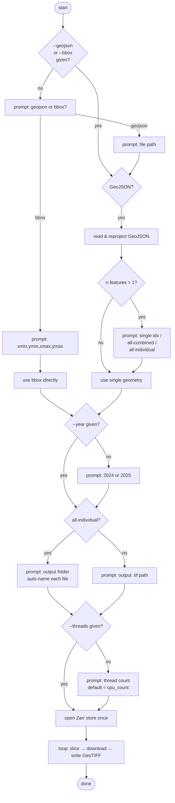
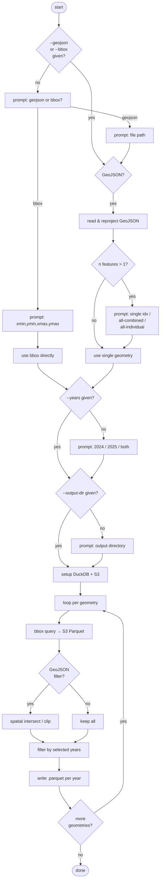

# Kuva scripts

This folder contains scripts added on top of the [ftw-baselines](README.md) repo. Most commands are thin wrappers around `ftw-tools` refer to the main README for polygonization and general inference options.

All scripts live under `scripts/kuva/`.

## Setup

Make sure the `kuva` optional dependencies are installed:

```bash
uv pip install ".[kuva]"
```

---

## Scripts

### `batch_inference.py`

Runs the same inference pipeline with multiple model checkpoints on a single input GeoTIFF. Useful for comparing models on the same area without repeating boilerplate.

```bash
uv run scripts/kuva/batch_inference.py /path/to/input.tif \
    --models model1.ckpt model2.ckpt \
    --out_dir ./output \
    --resize_factor 1 \
    --gpu 0
```

---

### `download_ftw_cube.py`

Downloads an 8-band planting+harvest composite (RGBNIR × 2 windows) from the [FTW global Zarr](https://source.coop/ftw/global-data) feature store.

Run with no flags for a fully interactive wizard, or pass any/all flags to skip the corresponding prompts:

| Flag | Interactive fallback |
|------|---------------------|
| `--geojson <file>` / `--bbox "x0,y0,x1,y1"` | Asked first: choose source type, then path or coords |
| *(GeoJSON with >1 feature)* | Geometry picker: single index / `all-combined` / `all-individual` |
| `--year 2024\|2025` | Prompted — only 2024 and 2025 are available |
| `--output <file>` / `--output <folder>` (all-individual) | Suggested default from input stem + year |
| `--threads N` | Prompted — default is `os.cpu_count()` |

```bash
# Fully interactive
uv run scripts/kuva/download_ftw_cube.py

# Pre-fill some flags; rest are prompted
uv run scripts/kuva/download_ftw_cube.py --geojson parcels.geojson --year 2025

# Fully non-interactive
uv run scripts/kuva/download_ftw_cube.py \
    --geojson parcels.geojson --year 2025 --output ./cube.tif --threads 8
```



---

### `fetch_ftw_fields.py`

Fetches FTW field prediction vectors for a given AOI from the remote S3 Parquet store and exports GeoParquet files (one per year).

Run with no flags for a fully interactive wizard, or pass any/all flags to skip the corresponding prompts:

| Flag | Interactive fallback |
|------|---------------------|
| `--geojson <file>` / `--bbox "x0,y0,x1,y1"` | Asked first: choose source type, then path or coords |
| *(GeoJSON with >1 feature)* | Geometry picker: single index / `all-combined` / `all-individual` |
| `--years 2024\|2025\|both` | Prompted — only 2024 and 2025 are available |
| `--output-dir <dir>` | Suggested default from input stem |

```bash
# Fully interactive
uv run scripts/kuva/fetch_ftw_fields.py

# Pre-fill some flags; rest are prompted
uv run scripts/kuva/fetch_ftw_fields.py --geojson parcels.geojson

# Fully non-interactive
uv run scripts/kuva/fetch_ftw_fields.py \
    --geojson parcels.geojson --years both --output-dir ./output --name my_fields
```



---

### `fetch_s2_scenes.py`

Finds the best Sentinel-2 planting/harvest scene pair for a given AOI and year by querying the Microsoft Planetary Computer STAC catalog. Can optionally download and merge the scenes into an 8-band input GeoTIFF ready for inference.

```bash
uv run scripts/kuva/fetch_s2_scenes.py \
    --geojson parcels.geojson \
    --year 2024 \
    --create-input \
    --output ./input.tif \
    --verbose
```

---

### `rgb_inference_baseline.py`

Runs inference with a FAUNet checkpoint on a 3-band RGB GeoTIFF. If the input is an 8-band bi-temporal file, use `--temporal t0` or `--temporal t1` to pick the desired window. Output is a uint8 label raster (0 = background, 1 = field, 2 = boundary) or raw float32 logits with `--save_scores`.

```bash
uv run scripts/kuva/rgb_inference_baseline.py input.tif \
    --model faunet.pth \
    --out output.tif \
    --temporal t0 \
    --gpu 0
```

---

### `run_sampling_combinations.py`

Sweeps over a predefined grid of `patch_size`, `resize_factor`, and `padding` values and runs inference for each combination on a single input image. Output filenames encode the parameters used (e.g. `ps256_rf2_pad16`). Handy for tuning sampling hyperparameters without writing custom loops.

```bash
uv run scripts/kuva/run_sampling_combinations.py /path/to/input.tif \
        --model /path/to/model.ckpt \
        --out_dir /path/to/output_dir \
        --gpu N \
        --batch_size N \
        --num_workers N
```

---

## Polygonization

After inference, use the `ftw inference polygonize` command documented in the [main README](README.md) to convert the label rasters to vector polygons.
